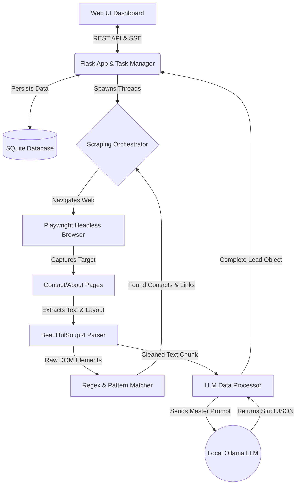

# Wise Local ProspectIQ ⚡

**Wise Local ProspectIQ** is a powerful, fully local, full-stack B2B lead generation and web scraping application. It provides an intuitive terminal-like dashboard designed to automate the painful process of prospecting, qualifying, and writing cold emails for offline/local businesses—all without relying on expensive third-party APIs.

It merges Playwright for bulletproof web scraping with local LLM AI (via Ollama) to extract intelligence natively on your hardware.

---

## 🌟 Key Features

### 1. 100% Local Pipeline (No API Keys)
The application relies strictly on your local hardware. It uses **Playwright** running instances of Chromium for bypass-resistant webpage fetching, and a local **Llama 3** instance (via Ollama) to generate deep intelligence—meaning absolutely zero API usage costs.

### 2. Live Batch Orchestrator
Upload a CSV of businesses, and the app will spawn concurrent background threads to scrape their website, contact pages, and about pages simultaneously. You can monitor the live progress directly in the browser via Server-Sent Events (SSE) and watch the integrated terminal log precisely what the AI is doing.

### 3. Deep AI Enrichment & Copywriting
The app doesn't just find emails. It uses Llama 3 to aggressively read the target's website and output:
- A 1-sentence **Summary** of exactly what the business does.
- Their exact business **Niche**.
- The **Name & Title** of the likely Decision Maker.
- A **Pitch Angle**: It finds weaknesses (e.g., "They don't explicitly offer 24/7 commercial service") so you can pitch a gap in their market.
- An **Opening Line**: It drafts a highly-personalized compliment based on their history or services to be used immediately in a cold email.

### 4. Lightning Quick-Search
About to hop on a sales call? Type a company name directly into the sticky top navigation bar. Within 20 seconds, the AI will scout the business, crawl it, and pop up an **Expert Intel Card** directly in your browser so you sound like an industry veteran the second you say hello.

### 5. Global Database Search 🔍
*New Feature:* You can instantly search your entire historical database of scraped leads effortlessly. Start typing a name, a niche, an email, or a decision maker into the Global Search bar in the **History & Results** tab, and the SQLite backend will fuzzy-match and render results in real-time across all your past batches.

### 6. One-Click Pitch Deck & Cold Email Drafter
When a successful lead is extracted, a "Draft Email" button appears next to their name. Clicking this instantly drafts a beautifully tailored cold email using the AI's generated Opening Line and Pitch Angle injected seamlessly into your Agency's custom services pitch template.

### 7. Blazing Fast Reused Architecture
Heavy performance optimizations mean lower execution times. A dedicated Python link-matcher identifies contact/about pages in `0.001s` rather than burdening the LLM, and Playwright recycles browser instances efficiently to shave significant overhead off page loads.

---

## 🛠️ Technology Stack

* **Backend / API:** Python (Flask), SQLite, Server-Sent Events (SSE).
* **Scraping Engine:** Playwright (Headless Chromium), BeautifulSoup 4.
* **LLM Engine:** Ollama (Running `llama3:8b` locally).
* **Frontend:** Vanilla JavaScript, HTML5, Custom CSS Variables (Dark UI).
* **Discovery:** DuckDuckGo / Clearbit (Zero-cost scouting logic).

### System Architecture Diagram


---

## ⚙️ Installation & Setup

You will need Python 3, Node/npm, and Ollama installed on your system.

### 1. Local AI Engine (Ollama)
To make the AI magic work locally, download and install [Ollama](https://ollama.com/).
Once installed, open a terminal and pull the Llama 3 model:
```powershell
ollama run llama3:8b
```
*(Leave Ollama running quietly in the background).*

### 2. Application Setup
Open a terminal in your project directory and set up your Python environment:
```powershell
# Create and activate virtual environment
python -m venv .venv
.\.venv\Scripts\activate

# Install strictly required dependencies
pip install Flask beautifulsoup4 playwright requests lxml

# Install Playwright browser binaries
playwright install chromium
```

---

## 🚀 Usage

Start the main Flask background server to boot the application:
```powershell
python app.py
```

Then, open your web browser and navigate to:
**[http://127.0.0.1:5000](http://127.0.0.1:5000)**

### Getting Started Checklist:
1. Go to the **Settings** tab and enter your Agency Information (Agency Name, Target Services, Call To Action). This empowers the Pitch Drafter to write emails on your behalf.
2. Go to the **Dashboard** and either drag-and-drop a CSV containing a `Business Name` column to run a complete batch, or use the top Quick Search bar to scan exactly one business instantly.
3. Check **History & Results** to globally search leads or export successful executions back strictly to cleaned `.CSV` sheets for your mass-emailing software.
